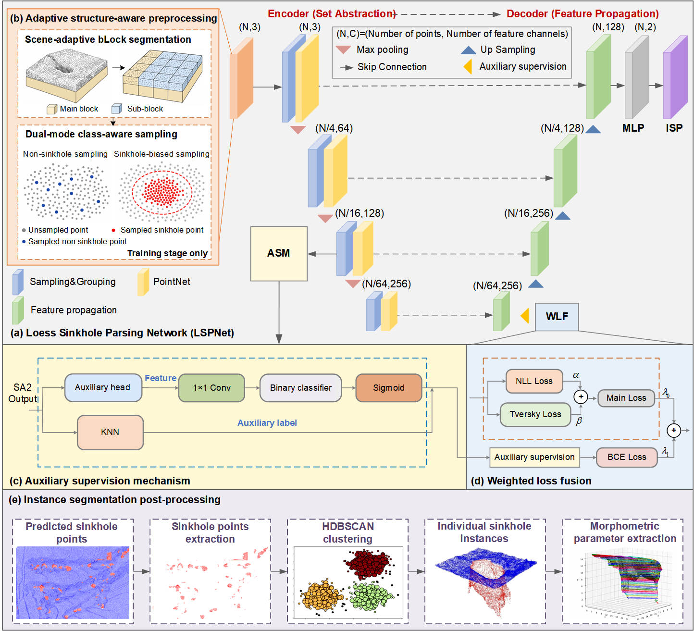

# LSPNet: Loess Sinkhole Parsing Network

LSPNet is a PointNet++-based point-cloud segmentation framework for automatic loess sinkhole identification, semantic segmentation, instance separation, and morphometric inventory construction from UAS-based LiDAR point clouds.

The framework is designed for class-imbalanced sinkhole segmentation, where sinkhole points usually represent only a small fraction of the full terrain point cloud.



## Main Features

- Adaptive structure-aware preprocessing for full-scene terrain point clouds.
- Dual-mode class-aware sampling to improve minority-class representation.
- PointNet++ backbone with an auxiliary supervision branch for small sinkhole targets.
- Weighted loss fusion using NLL loss, Tversky loss, and auxiliary BCE loss.
- HDBSCAN-based instance segmentation for individual sinkhole separation.
- Automatic extraction of sinkhole morphometric parameters and inventory files.

## Environment

The code was tested with:

- Ubuntu 20.04.1
- CUDA 11.3
- Python 3.8
- PyTorch 1.10.1
- NVIDIA GeForce RTX 3090 GPU with 24 GB memory

## Installation

Create and activate a conda environment:

```bash
conda create -n lspnet python=3.8
conda activate lspnet
```

Install PyTorch with CUDA 11.3:

```bash
pip install torch==1.10.1+cu113 torchvision==0.11.2+cu113 torchaudio==0.10.1+cu113 -f https://download.pytorch.org/whl/cu113/torch_stable.html
```

Install the remaining dependencies:

```bash
pip install -r requirements.txt
```

## Data

* The partially datasets used in the research can be downloaded [here](https://doi.org/10.5281/zenodo.22766769). Each point-cloud file should be stored as a plain text file with four columns:

```text
x y z label
```

The label definition is:

```text
0 = non-sinkhole point
1 = sinkhole point
```

Example directory structure:

```text
LSPNet/
  data/
    training_data/
      train_1.txt
      train_2.txt
      ...
    testing_data/
      test_1.txt
      test_2.txt
      ...
```

## Training & testing

```bash
python sinkhole_segmentation.py
```

After training, the best model checkpoint is saved as:

```text
data/block/checkpoints/best_model.pth
```

Predicting visualization can be performed with:

```bash
python prediction/my_predict.py
```
* You can open .txt files with [CloudCompare](https://www.cloudcompare.org/)


## Instance Segmentation

After semantic segmentation, predicted sinkhole points are separated into individual sinkhole instances using HDBSCAN:

```bash
python prediction/HDBSCSN_pre.py
```

## Morphometric Parameter Extraction

Morphometric parameters of individual sinkholes can be calculated with:

```bash
python prediction/sinkhole_metrics.py
```

The extracted parameters include:

- major axis
- minor axis
- perimeter
- area
- depth
- volume
- elongation ratio
- circularity index

The outputs include individual sinkhole point-cloud files, a morphometric parameter table, and geospatial inventory files.

## Notes

Some preprocessing steps, such as raw UAS-LiDAR filtering, manual sinkhole interpretation, and label generation, are performed outside this repository using software such as CloudCompare and ArcGIS. This repository starts from labeled point-cloud text files.

Several scripts currently use local default paths. Please update these paths according to your local data directory before running the workflow.

## Citation

If you use this code, please cite the related manuscript:

```text
Li et al. Automatic identification and segmentation of loess sinkholes in 3D point clouds using an enhanced PointNet++. Manuscript under review.
```

## Acknowledgement

This code is developed based on the PointNet++ implementation by Yan et al.:

```text
https://github.com/yanx27/Pointnet_Pointnet2_pytorch
```

## License

This project is released under the MIT License.
